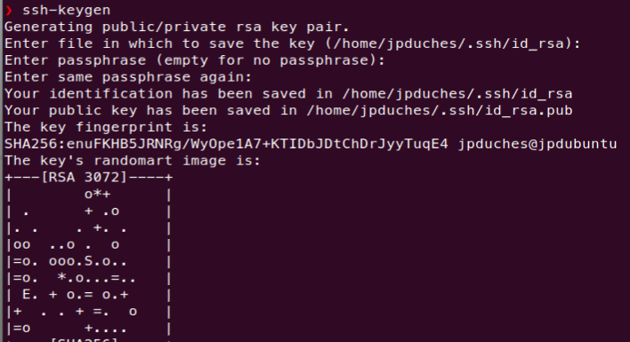

# Lecture et recherche sur Ansible


## Installation sur une VM Ubuntu 20.04 :
```bash
$sudo apt intall ansible
```
Vérification de la version d’Ansible
Vous avez installé Ansible ? Vous pouvez maintenant vérifier la version à l’aide de la commande suivante :
```bash
$ansible --version
```
Ci-dessous un exemple de sortie de cette commande (ici avec la version 2.9.6) :
```bash
nansible 2.9.6
  config file = /etc/ansible/ansible.cfg
  configured module search path = ['/home/jpduches/.ansible/plugins/modules', '/usr/share/ansible/plugins/modules']
  ansible python module location = /usr/lib/python3/dist-packages/ansible
  executable location = /usr/bin/ansible
  python version = 3.8.10 (default, Nov 26 2021, 20:14:08) [GCC 9.3.0]

```
##  Protocole SSH 
Ansible est principalement conçu pour gérer des machines à l’aide du protocole SSH ou via des commandes lancées en local. Il est également possible de gérer d’autres types de machines, comme par exemple des systèmes Windows, des conteneurs Docker ou encore via des mécanismes d’isolation (chroot ou jail).

Même s’il est possible de passer par des mots de passe pour se connecter aux machines Linux, il est fortement recommandé de passer par des clés SSH. La suite sera consacrée à la génération des clés SSH et à leur propagation sur les machines à administrer.

1. Généraration de la clé 

La génération de la clé est déclenchée par la commande ssh-keygen. On peut lui passer les options suivantes :

Le type de clé à générer (rsa ou dsa) avec -t [rsa|dsa].
L’emplacement où générer la clé avec -f <emplacement-clé>.

Une passphrase (phrase secrète) pour protéger la clé avec l’option -N.

Éventuellement la longueur de la clé (-b 2048 pour une clé de 2 048 bits).

Si vous ne passez pas de paramètres à la commande, ssh-keygen produira une clé RSA et la commande demandera les choses suivantes :
l’emplacement de la clé (par défaut $HOME/.ssh/id_rsa) ;
une passphrase et la confirmation de la passphrase.
Ci-dessous un exemple de création de clé :



2. Parc important de machines ou hébergement dans le cloud

Dans le cas de l’administration d’un parc important de machines (ou changeant souvent de clé SSH comme dans le cas de machines hébergées dans le cloud), il n’est pas faisable de maintenir la liste des signatures de machines distantes.

La désactivation de ce mécanisme se fait à l’aide des options SSH suivantes :

    Désactivation de la vérification stricte des clés SSH des machines distantes 
    (StrictHostKeyChecking no).

    Stockage des signatures de machines dans le fichier /dev/null 
    (UserKnownHostsFile /dev/null).

    Cette configuration se fait en alimentant le contenu du fichier ~/.ssh/config. Ci-dessous le contenu de ce fichier avec ces deux options :

```bash
StrictHostKeyChecking no 
UserKnownHostsFile /dev/null 
```

Je suis rendu ici.

J'ai pas réussi à me connecter à avec les étapes du chapitre suivant.
Donc je reviens ave c'est étapes page 
Échange de clé sans mot de passe
## Référence :

[Ansible - Gérez la configuration de vos serveurs et le déploiement de vos applications (2e édition) ](https://www.eni-training.com/portal/client/mediabook/home)

[Github-Ansible](https://github.com/EditionsENI/ansible)

[group discussion](https://groups.google.com/g/ansible-project)